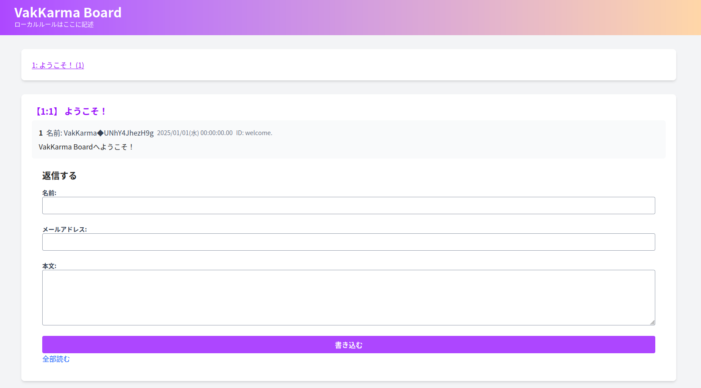

<div align="center">
  
  <h1>KassanBBS</h1>
  
  <p>2ちゃんねる風スレッドフロート型BBS (ex0ch互換)</p>
</div>

## 概要

KassanBBS は、2ちゃんねる/5ちゃんねる互換のスレッドフロート型BBSです。
[ex0ch](https://github.com/PrefKarafuto/ex0ch)（ゼロちゃんねるプラス派生）の全機能をTypeScript + PostgreSQLに移植しました。

TypeScript (HonoX) + PostgreSQL + Tailwind CSS のモダンスタックで構成され、Cloudflare Workers / Bun / Node.js のマルチランタイムに対応しています。

### 主な特徴

- **ex0ch互換**: 全移植機能（200+機能） - 管理画面、プラグイン、忍法帖、SLIP/Wattyoi 等
- **専ブラ対応**: ChMate / 2chMate 等の専用ブラウザに対応 (`/senbura/`)
- **マルチランタイム**: Cloudflare Workers / Bun / Node.js (Docker)
- **DDD設計**: ドメイン駆動設計 + neverthrow Result型によるエラーハンドリング
- **高セキュリティ**: JWT認証、HMAC署名、CSP、CSRF対策、XSS対策 等の8次監査219件修正済み
- **マルチボード**: 複数掲示板の運用に対応
- **レスポンシブ**: Tailwind CSS によるモバイル対応

## クイックスタート

### 開発環境

```bash
# 依存関係のインストール
pnpm install

# .envファイルを作成（.env.exampleをコピーして編集）
cp .env.example .env
# VITE_POSTGRES_USER, VITE_POSTGRES_PASSWORD, VITE_POSTGRES_DB を設定

# PostgreSQLを起動（Docker）
docker compose -f docker-compose.dev.yml up -d

# マイグレーション
pnpm run migrateup

# 開発サーバー起動
pnpm run dev
```

`http://localhost:80` にアクセス。

### 本番環境 (Docker)

```bash
docker compose -f docker-compose.prod.yml up -d
```

### 本番環境 (Cloudflare Workers)

```bash
pnpm run deploy:workers
pnpm wrangler secret put DATABASE_URL
pnpm wrangler secret put JWT_SECRET_KEY
```

## 初期設定

| 項目 | デフォルト値 |
|------|-------------|
| 管理画面 | `/admin` |
| ログインURL | `/login/admin` |
| ユーザー名 | `admin` |
| パスワード | `password`（**必ず変更してください**） |

## 機能一覧

### コア機能
- スレッド作成・レス投稿・検索・削除・編集
- NGワードフィルタリング
- スパム検知 (SpamKill)
- 重複投稿/タイトル検出
- スレッド管理（停止/プール/自動削除/アーカイブ/属性編集）
- 複数掲示板管理
- 管理者操作ログ

### 投稿機能
- トリップコード (`#key`)
- カラーネーム (`@RRGGBB@`)
- アイコン (`◆01` - 266種5ch互換)
- 投稿コマンド (`!sage`, `!markdown`, `!force774`, `!ninja`, `!othello` 等)
- 日別ID表示
- Capcode (◆) / スレ主 (主) / 副管理人 (副) 表示
- ユーザーCookie (名前/メール保存)
- `tasukeruyo` IP+UA表示
- 長文自動折りたたみ (30行以上)

### ユーザーコマンド (メッセージ本文)
`!changetitle`, `!delete`, `!add`, `!vote`, `!attr`, `!omikuji`, `!extend`, `!delcmd`, `!loadattr`, `!noid`, `!changeid`, `!ninlv`, `!change774`, `!sub`, `!cap`, `!pass`, `!maxres`, `!sage`, `!force774`, `!stop`, `!pool`, `!live`, `!slip`, `!ban`, `!hidenusi`, `!float`, `!nopool`

### 認証・セキュリティ
- JWT管理者認証
- 複数管理者・グループ権限管理 (30種capビットマスク)
- Cloudflare Turnstile / reCAPTCHA / hCaptcha
- ワンタイムパスワード認証 (!auth)
- CSRF対策 + HMAC署名Cookie
- 管理者操作ログ (7種類: ADMIN/ERR/THR/WRT/FLR/HST/SMB/SBH)
- 投稿失敗ログ (FLR) + 許可後投稿機能

### 規制・対策
- Samba段階的規制 (CAUTION→WARNING→LISTED→BANNED)
- 忍法帖 (Ninpocho) 100段階XPシステム + ゴールド経済
- ユーザー追跡 + 強制sage/kote
- IP/CIDR/ホスト/UA/セッション アクセス制御
- スレッド作成レート制限 (時間単位+ローリング)
- プロキシ検出 (proxycheck.io API)
- DNSBL連携 (Spamhaus等)
- VPN検出 (40+パターン)
- CDN/Proxy IP検出 (Cloudflare他)

### ex0ch互換機能
- **SLIP/Wattyoi**: 日本語キャリア40+パターン検出、週替わりシード、マルチレベル (vvv〜vvvvvv)
- **bbscgi互換**: `/test/bbs.cgi` (Shift_JIS対応)
- **read.cgi互換**: `/test/read.cgi/:bbs/:key/:options`
- **search.cgi互換**: 4種検索タイプ、日付範囲、カテゴリ
- **専ブラ対応**: `/senbura/subject.txt`, `SETTING.TXT`, `head.txt`, `dat/:key.dat`
- **エラーコード完全互換**: 70+エラーコード + 2ch互換Sambaコード (593/594/599)
- **トリップ生成**: SHA-1 + crypt互換

### 管理画面
- 基本設定（掲示板名/ルール/最大文字数/カラー等 50+設定項目）
- NGワード管理 + テスト機能
- IP制限管理（CIDR/ホスト/UA/セッション）
- スレッド管理（停止/プール/自動削除/属性編集/削除）
- レス管理（編集/削除/管理者投稿）
- 管理画面検索（スレッド/レス/ログ/忍法帖）
- ユーザー/グループ管理 + 権限設定
- 忍法帖管理（BAN/レベル設定）
- Samba管理
- プラグイン管理
- バナー/広告管理
- お知らせ管理
- 過去ログ管理
- 連合(Federation)設定
- インデックス再構築
- アップデート確認

### 追加機能
- タイムライン表示
- ゴールドランキング
- Madakana（規制情報表示）
- BE (be.2ch.net) 連携
- サーバー間連合 (Federation)
- プラグインシステム (Hook type 1/2/4/8/16/32/64 + Patch)
- ビルトインプラグイン（和暦表示/名無しランダム/オセロゲーム）
- ブラウザフィンガープリント
- マークダウン記法 + コンテンツ変換 (YouTube/NicoNico/Twitter埋め込み)
- 画像アップロード (Imgur OAuth2)
- VIP系ゲームコマンド (!IQ/!calc/!yakyu/!poke 等18種)

## 利用技術

| パッケージ | バージョン | 用途 |
|-----------|-----------|------|
| `hono` / `honox` | ^4.7 / ^0.1 | Webフレームワーク + メタフレームワーク |
| `postgres` | ^3.4 | PostgreSQLドライバ |
| `neverthrow` | ^8.2 | Result型エラーハンドリング |
| `bcrypt-ts` | ^6.0 | パスワードハッシュ化 |
| `tailwindcss` | ^4.0 | CSSフレームワーク |
| `vite` | ^6.2 | ビルドツール |
| `vitest` | ^3.1 | テストフレームワーク |
| `wrangler` | ^4.0 | Cloudflare Workersデプロイ |
| `iconv-lite` | ^0.6 | Shift_JIS変換（専ブラ対応） |

## アーキテクチャ

```
app/          # HonoX プレゼンテーション層（ルート/コンポーネント/アイランド）
  routes/     #   ファイルベースルーティング
  components/ #   JSXコンポーネント
  islands/    #   クライアントサイドJS（ハイドレーション）
  middlewares/ #   Honoミドルウェア
src/          # ドメイン/アプリケーション層
  config/     #   設定コンテキスト
  conversation/ # スレッド/レスコンテキスト
  * (40+ モジュール) # 各機能のドメイン/ユースケース/リポジトリ
db/           # データベース（PostgreSQL）
  migrations/ #   マイグレーション
```

## 専ブラ (ChMate) 登録方法

`https://(ホスト)/senbura/` をURLに登録。

## ライセンス

MIT

## 開発者

- [maebahesioru](https://github.com/maebahesioru)

### ベース
- [ex0ch](https://github.com/PrefKarafuto/ex0ch) - Perl版ゼロちゃんねるプラス派生
- [calloc134/vakkarma-main](https://github.com/calloc134/vakkarma-main) - オリジナルのTypeScript版
